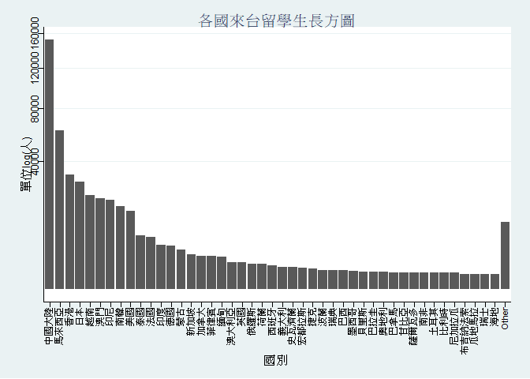
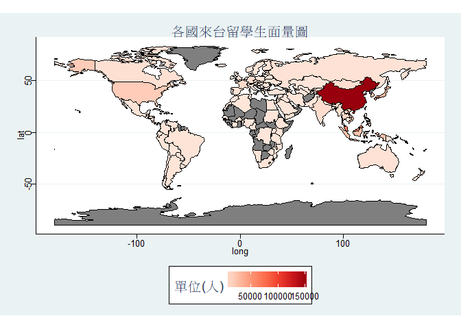
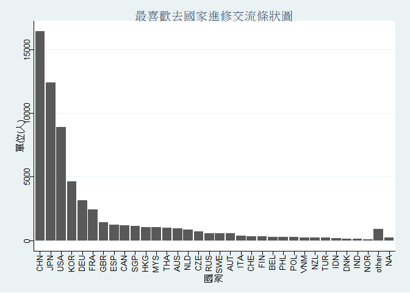
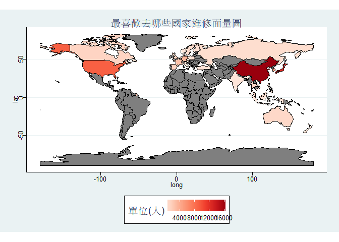
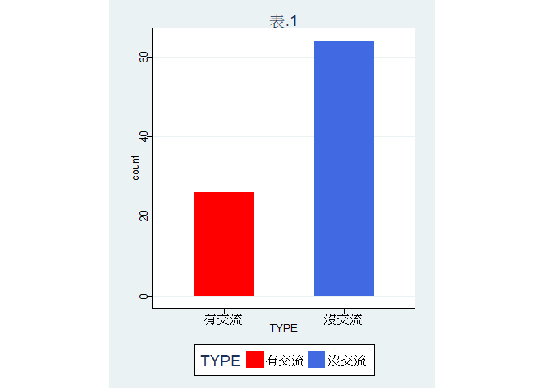
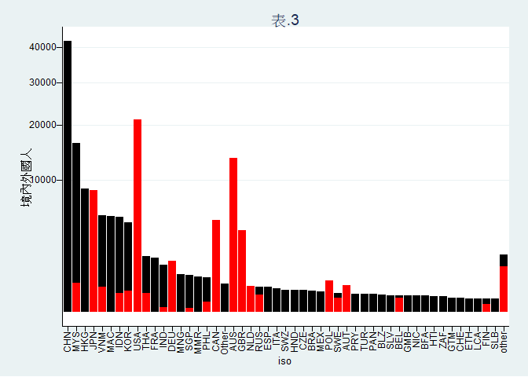

106-2 大數據分析方法 作業二
================
林耿在B0322013

作業完整說明[連結](https://docs.google.com/document/d/1aLGSsGXhgOVgwzSg9JdaNz2qGPQJSoupDAQownkGf_I/edit?usp=sharing)

學習再也不限定在自己出生的國家，台灣每年有許多學生選擇就讀國外的大專院校，同時也有人多國外的學生來台灣就讀，透過分析[大專校院境外學生人數統計](https://data.gov.tw/dataset/6289)、[大專校院本國學生出國進修交流數](https://data.gov.tw/dataset/24730)、[世界各主要國家之我國留學生人數統計表](https://ws.moe.edu.tw/Download.ashx?u=C099358C81D4876CC7586B178A6BD6D5062C39FB76BDE7EC7685C1A3C0846BCDD2B4F4C2FE907C3E7E96F97D24487065577A728C59D4D9A4ECDFF432EA5A114C8B01E4AFECC637696DE4DAECA03BB417&n=4E402A02CE6F0B6C1B3C7E89FDA1FAD0B5DDFA6F3DA74E2DA06AE927F09433CFBC07A1910C169A1845D8EB78BD7D60D7414F74617F2A6B71DC86D17C9DA3781394EF5794EEA7363C&icon=..csv)可以了解103年以後各大專院校國際交流的情形。請同學分析以下議題，並以視覺化的方式呈現分析結果，呈現103年以後大專院校國際交流的情形。

來台境外生分析
--------------

### 資料匯入與處理

``` r
library(readODS)
library(rio)
library(readr)
library(dplyr)
library(rvest)
library(ggmap)
library(RColorBrewer)
library(choroplethr)
library(choroplethrMaps)
library(ggthemes)
OOOPop103_N<-read_csv("https://quality.data.gov.tw/dq_download_csv.php?nid=6289&md5_url=25f64d5125016dcd6aed42e50c972ed0")
OOOPop104_N<-read_csv("https://quality.data.gov.tw/dq_download_csv.php?nid=6289&md5_url=4d3e9b37b7b0fd3aa18a388cdbc77996")
OOOPop105_N<-read_csv("https://quality.data.gov.tw/dq_download_csv.php?nid=6289&md5_url=19bedf88cf46999da12513de755c33c6")
OOOPop106_N<-read_csv("https://quality.data.gov.tw/dq_download_csv.php?nid=6289&md5_url=50e3370f9f8794f2054c0c82a2ed8c91")

OOOPop103_C<-read_csv("https://quality.data.gov.tw/dq_download_csv.php?nid=6289&md5_url=a6d1469f39fe41fb81dbfc373aef3331")
OOOPop104_C<-read_csv("https://quality.data.gov.tw/dq_download_csv.php?nid=6289&md5_url=8baeae81cba74f35cf0bb1333d3d99f5")
OOOPop105_C<-read_csv("https://quality.data.gov.tw/dq_download_csv.php?nid=6289&md5_url=1a485383cf9995da679c3798ab4fd681")
OOOPop106_C<-read_csv("https://quality.data.gov.tw/dq_download_csv.php?nid=6289&md5_url=883e2ab4d5357f70bea9ac44a47d05cc")
OOOPop103_N<-mutate(OOOPop103_N,
                    Pop103 = rowSums(OOOPop103_N[,c(-1,-2)]))
OOOPop104_N<-mutate(OOOPop104_N,
                    Pop104 = rowSums(OOOPop104_N[,c(-1,-2)]))
OOOPop105_N<-mutate(OOOPop105_N,
                    Pop105 = rowSums(OOOPop105_N[,c(-1,-2)]))
OOOPop106_N<-mutate(OOOPop106_N,
                    Pop106 = rowSums(OOOPop106_N[,c(-1,-2)]))


perYearPop<- inner_join(OOOPop103_N[,c(1,2,12)],OOOPop104_N[,c(1,2,12)],by = c("洲別", "國別"))

perYearPop<- inner_join(perYearPop,OOOPop105_N[,c(1,2,12)],by = c("洲別", "國別"))

perYearPop<- inner_join(perYearPop,OOOPop106_N[,c(1,2,12)],by = c("洲別", "國別"))
OOOPop103_C$`非學位生-大陸研修生`<-as.numeric(
  gsub("…",NA,OOOPop103_C$`非學位生-大陸研修生`))
OOOPop103_C<-mutate(OOOPop103_C,
                    Pop103 = rowSums(OOOPop103_C[,c(-1,-2,-3)], 
                                     na.rm = TRUE)  )
OOOPop104_C$`非學位生-大陸研修生`<-as.numeric(
  gsub("…",NA,OOOPop104_C$`非學位生-大陸研修生`))
OOOPop104_C<-mutate(OOOPop104_C,
                    Pop104 = rowSums(OOOPop104_C[,c(-1,-2,-3)], 
                                     na.rm = TRUE)  )
OOOPop105_C<-mutate(OOOPop105_C,
                    Pop105 = rowSums(OOOPop105_C[,c(-1,-2,-3)], 
                                     na.rm = TRUE)  )
OOOPop106_C<-mutate(OOOPop106_C,
                    Pop106 = rowSums(OOOPop106_C[,c(-1,-2,-3)], 
                                     na.rm = TRUE)  )
perColPop<- full_join( OOOPop103_C[,c(3,13)] , 
                        OOOPop104_C[,c(3,13)],by = "學校名稱")
perColPop<- full_join( perColPop , 
                        OOOPop105_C[,c(3,13)],by = "學校名稱")
perColPop<- full_join( perColPop , 
                        OOOPop106_C[,c(3,13)],by = "學校名稱")
perYearPop<-mutate(perYearPop,
  totalPop = rowSums(perYearPop[,c(-1,-2)])) %>%
    arrange( desc(totalPop) , desc(Pop106) )

# library(readr)
# library(RColorBrewer) 
EZ <- read_csv("EZ.csv", 
               locale = locale(encoding = "BIG5"))
colnames(EZ)<-c("國別","GEC代碼","二位字母代碼","iso_a3",
                "ISO3166-1三位數字代碼","STANAG_1059Stanag標準化國碼",
                "網際網路","註說")
countryCode<-left_join( perYearPop[,c(1,2,7)],
                        EZ[,c(1,4)] ,
                        by = "國別")

index<-grep("[A-Z]{3}",countryCode$iso_a3,invert=T)
countryCode$iso_a3[index]<-c("CHN","KOR","AUS","VCT",
                             "KNA","MHL","COD","SRB","UAR")
data(country.map)
final.plot<-merge(country.map,
                  countryCode,by="iso_a3",all.x=T)%>%
            group_by(group)%>%
            arrange(order)
```

### 哪些國家來台灣唸書的學生最多呢？

``` r
knitr::kable(head(perYearPop[,c(1,2,7)], 10))
```

| 洲別 | 國別     |  totalPop|
|:-----|:---------|---------:|
| 亞洲 | 中國大陸 |    152524|
| 亞洲 | 馬來西亞 |     62031|
| 亞洲 | 香港     |     31940|
| 亞洲 | 日本     |     28200|
| 亞洲 | 越南     |     21670|
| 亞洲 | 澳門     |     20302|
| 亞洲 | 印尼     |     19620|
| 亞洲 | 南韓     |     16948|
| 美洲 | 美國     |     14846|
| 亞洲 | 泰國     |      7035|

由圖表可以看出來台灣的外國留學生以亞洲為主，其中又以中國大陸以及馬來西亞兩國為大宗。留學生數的前十名只有美國為亞洲以外的國家。

### 哪間大學的境外生最多呢？

``` r
perColPop<- mutate(perColPop,
                   SumPop = rowSums( perColPop[,-1],
                                     na.rm = TRUE))%>%
  arrange(desc(SumPop))
knitr::kable(subset(perColPop[,c(1,6)],`學校名稱`=="國立臺灣師大僑生先修部"))
```

| 學校名稱               |  SumPop|
|:-----------------------|-------:|
| 國立臺灣師大僑生先修部 |    3676|

``` r
knitr::kable(head(perColPop[,c(1,6)],10))
```

| 學校名稱         |  SumPop|
|:-----------------|-------:|
| 無法區分校別     |   92586|
| 國立臺灣師範大學 |   22113|
| 國立臺灣大學     |   18199|
| 中國文化大學     |   16074|
| 銘傳大學         |   16057|
| 淡江大學         |   13887|
| 國立政治大學     |   11626|
| 國立成功大學     |   10982|
| 輔仁大學         |    9499|
| 逢甲大學         |    9474|

如表格所示，最多境外生為無法區分校別的單位，是無效的。因此最多境外生的大學為國立臺灣師範大學，再來是台大。此外，師大還有設立僑生先修部，四年內人數為3676人，若一同算入師大的境外生人數的話師大的人數大幅高於其他的大學。

### 各個國家來台灣唸書的學生人數條狀圖

``` r
perYIndex<-nrow(filter(perYearPop,totalPop>500))
perYearPop1<-group_by(perYearPop,`國別`)%>%
          tally(totalPop, sort = TRUE) %>%
          group_by(`國別` = 
             factor(c(`國別`[1:perYIndex],rep("Other", n() - perYIndex)),
                    levels = c(`國別`[1:perYIndex], "Other")) ) %>%
  tally(n)
ggplot(perYearPop1)+
  geom_bar(aes(x=`國別`,y=nn),stat = "identity")+
  scale_y_sqrt()+
  theme_stata() + scale_colour_stata()+
  theme(axis.text.x = element_text(angle = 90, vjust = 0.3, hjust = 1,size = 8))+
  labs(y="單位log(人)",title = "各國來台留學生長方圖")
```

 如各國來台留學生長方圖所示，中國來台留學的學生大幅高於其他國家，圖中的單位調整為log10的刻度，來台留學人口數第二名的馬來西亞尚未達到中國人數的一半。

### 各個國家來台灣唸書的學生人數面量圖

``` r
wldmap<-ggplot() +
  geom_polygon(data = final.plot, 
               aes(x = long, y = lat, 
                   group = group, 
                   fill =  totalPop), 
               color = "black", 
               size = 0.25,
               na.rm = T) +
  coord_cartesian(xlim = c(-200, 200),ylim = c(-90, 90))+
  coord_fixed()+#維持地圖比例
  scale_fill_gradientn(colours = brewer.pal(7,"Reds"))+ 
  theme_void()+
  labs(fill="單位(人)",title = "各國來台留學生面量圖")+
  theme_stata() + scale_colour_stata()
wldmap
```

 由各國來台留學生面量圖中，其實能發現來台灣留學的學生來自世界各地，大部分留學生的母國集中在東亞，如中國、馬來西亞、日本、韓國、印尼等等......。

台灣學生國際交流分析
--------------------

### 資料匯入與處理

``` r
TWtoWld <- read_csv("Student_RPT_07.csv", 
                    locale = locale(encoding = "BIG5"),
                    skip = 1)
TWtoWldNAME<-colnames(TWtoWld)
TWtoWldNAME01<-TWtoWld[1,]
colnames(TWtoWld)[c(3,4,5,6,11,12,13,14,15)]<-TWtoWldNAME01[c(3,4,5,6,11,12,13,14,15)]
TWtoWld <- TWtoWld[-1,]
remove(TWtoWldNAME01,TWtoWldNAME)
TWtoWld$`小計`<-as.numeric(TWtoWld$`小計`)
TWtoWld$`男`<-as.numeric(TWtoWld$`男`)
TWtoWld$`女`<-as.numeric(TWtoWld$`女`)
TWtoWld1 <- TWtoWld
library(readr)
EZ <- read_csv("EZ.csv", 
               locale = locale(encoding = "BIG5"))
colnames(EZ)<-c("對方學校(機構)國別(地區)",   "GEC代碼","二位字母代碼","iso_a3","ISO 3166-1三位數字代碼","STANAG_1059Stanag標準化國碼","網際網路"    ,"註說")

wldData1<-group_by(TWtoWld1,`對方學校(機構)國別(地區)`)%>% 
  summarise(cCount = sum(`小計`,na.rm = T))%>%
  arrange(desc(cCount))

countryCode1<-left_join( wldData1,EZ[,c(1,4)] ,by =  "對方學校(機構)國別(地區)")

countryCode1[grep("[A-Z]{3}",countryCode1$iso_a3,invert=T),]
```

    ## # A tibble: 71 x 3
    ##    `對方學校(機構)國別(地區)` cCount iso_a3
    ##    <chr>                       <dbl> <chr> 
    ##  1 中國大陸                   10429. <NA>  
    ##  2 大陸地區                    5996. <NA>  
    ##  3 南韓                        2498. <NA>  
    ##  4 大韓民國(南韓)              2131. <NA>  
    ##  5 德意志聯邦共和國            1458. <NA>  
    ##  6 澳大利亞                     926. <NA>  
    ##  7 泰王國(泰國)                 567. <NA>  
    ##  8 新加坡共和國                 479. <NA>  
    ##  9 西班牙王國                   478. <NA>  
    ## 10 荷蘭王國                     349. <NA>  
    ## # ... with 61 more rows

``` r
#可以發現此表格有些國家的名稱重複，如大陸地區和中國大陸、大韓民國(南韓)和南韓。
countryCode1$iso_a3[grep("[A-Z]{3}",countryCode1$iso_a3,invert=T)]<-
  c("CHN","CHN","KOR","KOR","DEU","AUS","THA","SGP","ESP","NLD",
    "CZE","AUT","RUS","SWE","PHL","BEL","IDN","VNM","FIN","ITA",
    "POL","TUR","IND","DNK","LTU","NOR","IRL","SVK","KHM","EGY",
    NA,NA,NA,NA,NA,NA,NA,NA,NA,NA,
    NA,NA,NA,NA,NA,NA,NA,NA,NA,NA,
    NA,NA,NA,NA,NA,NA,NA,NA,NA,NA,
    NA,NA,NA,NA,NA,NA,NA,NA,NA,NA,NA)
countryCode1<-group_by(countryCode1,iso_a3)%>% 
  summarise(cCount = sum(cCount,na.rm = T))%>%
  arrange(desc(cCount))
wldIndex<-nrow(filter(countryCode1,cCount>20))

countryCode1$iso_a3<- factor(countryCode1$iso_a3,
       levels = c(countryCode1$iso_a3[order(countryCode1$cCount,
                                     decreasing =T)],"other"))
countryCode1<-countryCode1

countryCode1<-rbind.data.frame(countryCode1%>%filter(cCount>100),
                  countryCode1%>%filter(cCount<=100)%>%
                    summarise(iso_a3="other",
                              cCount=sum(cCount,na.rm=T)))
```

### 台灣大專院校的學生最喜歡去哪些國家進修交流呢？

``` r
knitr::kable(head(countryCode1,10))
```

| iso\_a3 |  cCount|
|:--------|-------:|
| CHN     |   16425|
| JPN     |   12430|
| USA     |    8916|
| KOR     |    4629|
| DEU     |    3164|
| FRA     |    2415|
| GBR     |    1416|
| ESP     |    1252|
| CAN     |    1180|
| SGP     |    1157|

如表所示，台灣大專院校的學生，去外國進修的人最喜歡去的國家前三名分別是：中國(CHN)、日本(JPN)及南韓(KOR)。

### 哪間大學的出國交流學生數最多呢？

``` r
clgData1<-group_by(TWtoWld1,`學校名稱`)%>%
          summarise(cCount = sum(`小計`,na.rm = T))%>%
          arrange(desc(cCount))
clgIndex<-nrow(filter(clgData1,cCount>10))
clgData1<-group_by(clgData1, `學校名稱`)%>%
          tally(cCount, sort = TRUE) %>%
          group_by(`學校名稱` = 
             factor(c(`學校名稱`[1:clgIndex],rep("Other", n() - clgIndex)),
                    levels = c(`學校名稱`[1:clgIndex], "Other")) ) %>%
  tally(n)
knitr::kable(head(clgData1,10))
```

| 學校名稱     |    nn|
|:-------------|-----:|
| 國立臺灣大學 |  4719|
| 淡江大學     |  3794|
| 國立政治大學 |  3479|
| 逢甲大學     |  2646|
| 東海大學     |  1881|
| 元智大學     |  1864|
| 國立交通大學 |  1513|
| 東吳大學     |  1457|
| 國立成功大學 |  1397|
| 國立臺北大學 |  1397|

出國進修的學生來自以下大學，如：臺灣大學、臺灣大學、臺灣大學及臺灣大學。

### 台灣大專院校的學生最喜歡去哪些國家進修交流條狀圖

``` r
ggplot(countryCode1)+
  geom_bar(aes(x =  iso_a3, y = cCount),
           stat = "identity")+
  theme_stata() + scale_colour_stata()+
  theme(axis.text.x = element_text(angle = 90,vjust = 0.3, hjust = 1))+
  labs(x="國家",y="單位(人)",title = "最喜歡去國家進修交流條狀圖")
```



如此條狀圖所示，台灣學生最愛去進修交流的國家前三名為：中國(CHN)、日本(JPN)及南韓(KOR)，尤其人數前二名的國家人數大幅高於其他國家。

### 台灣大專院校的學生最喜歡去哪些國家進修交流面量圖

``` r
data(country.map)
final.plot<-merge(country.map,
                  countryCode1,by="iso_a3",all.x=T)%>%
  group_by(group)%>%
  arrange(order)
library(RColorBrewer) 
wldmap<-ggplot() +
  geom_polygon(data = final.plot, 
               aes(x = long, y = lat, 
                   group = group, 
                   fill =  cCount), 
               color = "black", 
               size = 0.25,
               na.rm = T) +
  coord_cartesian(  xlim = c(-200, 200) ,ylim = c(-90, 90))+
  coord_fixed()+#維持地圖比例
  scale_fill_gradientn(colours = brewer.pal(7,"Reds"))+ 
  theme_void()+
  labs(fill="單位(人)",title = "最喜歡去哪些國家進修面量圖")+
  theme_stata() + scale_colour_stata()
wldmap
```



如圖所示，顏色深(人數多)的國家大多集中在東亞地區，而其他台灣學生喜歡去的國家為北美及西歐。

台灣學生出國留學分析
--------------------

### 資料匯入與處理

### 台灣學生最喜歡去哪些國家留學呢？

``` r
knitr::kable(head(countryCode[,c(1,2,3)],10))
```

| 洲別   | 國別     | 總人數 |
|:-------|:---------|:------:|
| 美洲   | 美國     |  21127 |
| 大洋洲 | 澳大利亞 |  13582 |
| 亞洲   | 日本     |  8444  |
| 美洲   | 加拿大   |  4827  |
| 歐洲   | 英國     |  3815  |
| 歐洲   | 德國     |  1488  |
| 大洋洲 | 紐西蘭   |  1106  |
| 歐洲   | 波蘭     |   561  |
| 亞洲   | 馬來西亞 |   502  |
| 歐洲   | 奧地利   |   419  |

如表所示，前三名的國家為美國：21127、澳大利亞：13582與日本：8444。

### 台灣學生最喜歡去哪些國家留學面量圖

``` r
library(RColorBrewer) 
wldmap<-ggplot() +
  geom_polygon(data = final.plot, 
               aes(x = long, y = lat, 
                   group = group, 
                   fill =  `總人數`), 
               color = "black", 
               size = 0.25,
               na.rm = T) +
  coord_cartesian(  xlim = c(-200, 200) ,ylim = c(-90, 90))+
  coord_fixed()+#維持地圖比例
  scale_fill_gradientn(colours = brewer.pal(7,"Reds"))+ 
  theme_void()+
  labs(fill="單位(人)",title = "最喜歡去哪些國家留學面量圖")+
  theme_stata() + scale_colour_stata()
wldmap
```

 台灣出國留學(不包含進修)的學生如圖所示。

綜合分析
--------

請問來台讀書與離台讀書的來源國與留學國趨勢是否相同(5分)？想來台灣唸書的境外生，他們的母國也有很多台籍生嗎？請圖文並茂說明你的觀察(10分)。

### 資料匯入

``` r
perYearPop<-NULL

perYearPop<- OOOPop105_N[,c(1,2,12)]
perYearPop<-mutate(perYearPop,
                   totalPop = rowSums(perYearPop[,c(-1,-2)])) %>%
  arrange( desc(totalPop)  )
EZ1<-EZ[,c(1,4)]
colnames(EZ1)<-c("國別","iso_a3")
analData1<-left_join( perYearPop[,c(2,4)],EZ1 ,by =  "國別")
analData1$iso_a3[grep("[A-Z]{3}",analData1$iso_a3, invert=T)]<-
  c("CHN","KOR","AUS","VCT","KNA","MHL","COD","SRB","UAR")

analData1Index<-nrow(filter(analData1,totalPop>20))
analData1<-group_by(analData1, iso_a3)%>%
  tally(totalPop, sort = TRUE) %>%
  group_by(iso_a3 = 
             factor(c(iso_a3[1:analData1Index],rep("Other", n() - analData1Index)),
                    levels = c(iso_a3[1:analData1Index], "Other")) ) %>%
  tally(n)

##
wldISPop<-read_csv("https://goo.gl/9tsyQL",na = "NA")
wldData2<-data.frame(
  wldISPop,stringsAsFactors = F
  )
remove(wldISPop)
wldData2<-wldData2[,c(1,2,3)]

wldData2<-wldData2%>%arrange(desc(`總人數`))

EZ2<-EZ[,c(1,4)]
colnames(EZ2) <- c("國別","iso_a3")
countryCode<-left_join( wldData2,EZ2 ,by =  "國別")

countryCode$iso_a3[grep("[A-Z]{3}",countryCode$iso_a3,invert=T)]<-
  c("AUS")
analData2<-countryCode
analData<-full_join(analData1,analData2[,c(4,3)],by = "iso_a3")


colnames(analData)<-c("iso","境內外國人","境外台灣人")
analData$TYPE<-ifelse(!is.na(analData[,2]-analData[,3]),"有交流","沒交流")
analData<-arrange(analData,desc(`境內外國人`))
analData$iso<- factor(analData$iso,
       levels = c(analData$iso[order(analData$`境內外國人`,
                                     decreasing =T)],"other"))
analDataQ1<-analData

analDataQ1<-rbind.data.frame(analDataQ1%>%filter(`境內外國人`>100),
                  analDataQ1%>%filter(`境內外國人`<=100)%>%
                    summarise(iso="other",
                              `境內外國人`=sum(`境內外國人`,na.rm=T),
                              `境外台灣人`=sum(`境外台灣人`,na.rm=T),
                              TYPE = "沒交流"))
```

### 綜合分析圖表

``` r
ggplot(analData,aes(x=TYPE,fill = TYPE))+
  geom_bar( width = 0.5)+
  coord_fixed(ratio = 1/30)+
  scale_fill_manual(values = c("red","royalblue"))+
  theme_stata() + labs(title = "表.1")+
  scale_colour_stata()
```



``` r
analData[order(analData$TYPE,decreasing = T),][c(-1,-2,-3,-4),]
```

    ## # A tibble: 86 x 4
    ##    iso   境內外國人 境外台灣人 TYPE  
    ##    <fct>      <dbl>      <dbl> <chr> 
    ##  1 MNG         833.         NA 沒交流
    ##  2 MMR         713.         NA 沒交流
    ##  3 Other       466.         NA 沒交流
    ##  4 ESP         370.         NA 沒交流
    ##  5 ITA         329.         NA 沒交流
    ##  6 SWZ         288.         NA 沒交流
    ##  7 HND         280.         NA 沒交流
    ##  8 CZE         275.         NA 沒交流
    ##  9 BRA         268.         NA 沒交流
    ## 10 MEX         237.         NA 沒交流
    ## # ... with 76 more rows

``` r
knitr::kable(head(analData[order(analData$TYPE,decreasing = T),][c(-1,-2,-3,-4),],10))
```

| iso   | 境內外國人 | 境外台灣人 | TYPE   |
|:------|:----------:|:----------:|:-------|
| MNG   |     833    |     NA     | 沒交流 |
| MMR   |     713    |     NA     | 沒交流 |
| Other |     466    |     NA     | 沒交流 |
| ESP   |     370    |     NA     | 沒交流 |
| ITA   |     329    |     NA     | 沒交流 |
| SWZ   |     288    |     NA     | 沒交流 |
| HND   |     280    |     NA     | 沒交流 |
| CZE   |     275    |     NA     | 沒交流 |
| BRA   |     268    |     NA     | 沒交流 |
| MEX   |     237    |     NA     | 沒交流 |

``` r
ggplot(analDataQ1)+
  geom_bar(aes(x=iso,y=`境內外國人`),
           stat = "identity",fill = "black")+
  geom_bar(aes(x=iso,y=`境外台灣人`),
           stat = "identity",fill = "red")+
  labs(fill="",title = "表.3")+
  scale_y_sqrt()+ theme_stata() + scale_colour_stata()+
  theme(axis.text.x = 
          element_text(angle = 90,vjust = 0.3, hjust = 1,size = 9),
        axis.text.y = 
          element_text(angle = 0,vjust = 0.3, hjust = 1,size = 9))
```

 由表.1，沒有交流的國家的個數遠高於有互相交流的國家個數。並且大部分沒交流的國家的情況，是台灣沒有學生去該國留學，但是該國有學生來台灣留學，如表.2，因此想來台灣讀書外國學生的國家並沒有很多台籍生。表.3所示，台灣人喜歡留學的國家，並沒有相對地有很多人來台留學，有點熱臉貼冷屁股的感覺。
